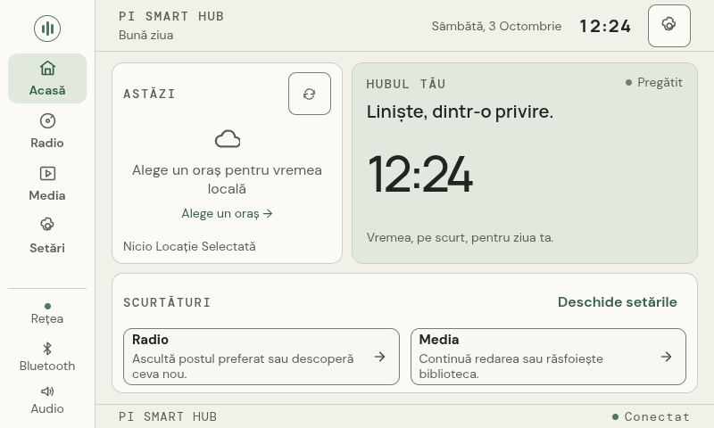

# Fresh corrected USB candidate a32c29065d6d — 2026-10-03

Image source d61ec8d23c4c025167bd009a67e9cfcab4193a72, runtime a32c29065d6d, builder262d4df5a9f9d4133370465399a7958a7c22cdc7. Owner physically moved the verified USB to Raspberry, removed/retained the original SD and powered the device on. Recovery login succeeded with the separately provisioned administrative key. Host keys are absent from the generic image and are recorded separately for this new installation on first connection.

Actual boot: hostname pysh, kernel6.18.50+rpt-rpi-v8, root /dev/sda2 UUID5610e056-221b-46c9-8046-65c9adb6a5c1, SanDisk256,087,425,024 bytes. Root expansion stamp reports255,810,580,480 filesystem bytes. Boot ID7ced882f-dfa4-48e5-be77-8655baedb2ff. greetd/SSH/NetworkManager/BlueZ and user pysh.service active, zero failed units. All33 installed runtime file hashes match the CI manifest. DSI-1 is800×480 at60.029Hz, transform180, scale1. Bluetooth plugin installed1.4.2-1+rpt3. No post-boot source/session/package repair was required.

Owner explicitly confirmed correct physical orientation and that Continue advances to Connectivity on this fresh image. The rest of the initial wizard was completed through the actual kiosk with optional weather/speaker choices deferred. Subsequent real scans found four Wi-Fi networks and the known speaker, with Ethernet retained. Network label is Wired connection1.

Native existing-kiosk EN/RO × E-Ink/night survey:48 screens, zero measured small targets, text below14px, text-contrast violations or JavaScript errors.120 navigation samples, combined p9567.5ms;30 per destination: Home22.6, Radio101.6, Media33.1, Settings29.4ms. These scope-specific measurements do not certify all control-boundary contrast, all body-text roles or the complete physical touch tour.

Known ML-DAC-SPKBT-QC15 was discovered unpaired, then paired from scratch, trusted, connected and selected as active Bluetooth output via the real app API. No previous Bluetooth state was restored. Owner confirmed the15-second alternating WAV tone was audible from the speaker. Later disconnect/reconnect probe paused playback and removed readiness; Resume without output returned409/no_audio_output. Reconnect restored active Bluetooth, volume30/mute=true, then playback recovered. Original audio settings restored. Pair/forget/refusal/timeout and all UI interactions are not collectively certified by these probes.

Real muted local decoding: WAV/PCM16, MP3, AAC, M4A/AAC, FLAC, OGG/Vorbis, OGA/Vorbis and Opus all advanced playback. Missing file returned409/media_not_found; invalid MP3 reached stream_failed; valid playback recovered; natural completion reached ended. Native controls passed queue previous/next boundaries, pause/resume, seek, EOF replay, stop and48px targets in all four language/theme combinations, with zero JavaScript errors. Two owned45-second WAVs were used for control tests.

Native video: MP4/M4V/MKV/MOV with H.264/AAC and WebM with VP9/Opus at480×270 all decoded and advanced with no video error. EN/RO × both themes passed pause/resume, seek, volume30, mute/unmute, back and invalid-video retry/back. Zero JavaScript errors. This evidence covers these encodings, not every codec a container might carry.

Real [Radio Swiss Classic](https://www.radioswissclassic.ch/en/reception/internet) and [Radio Swiss Jazz](https://www.radioswissjazz.ch/en/reception/internet) official streams passed native UI row pause/resume and mini-player stop/replay: eight station/language/theme flows. Four reserved-invalid-domain cases showed localized playback errors and recovered by selecting a valid station. Muted during automation; acoustic radio acceptance and actual network interruption remain separate. Favorites, last station and audio settings restored.

Service-mode native UI passed cancel, entry, diagnostic availability, return and language/theme preservation in EN/RO × both themes, zero JavaScript errors. Owned-process crash probe replaced API in2.650s and kiosk in0.885s, preserving the exact preferences hash; zero owned zombies and one live mpv after cleanup grace. REL-02 is revalidated on this identified candidate. Timings describe process/API recovery, not final rendered-page latency.

Five qualified app relaunches reached native Home/fonts loaded in4.1033,3.9679,4.0012,4.1135,3.9632 seconds. Complete15-process idle PSS559.097MiB, zero zombies, sampled at Home+120.1482s and finished120.2894s, below700MiB. An initial probe run was incomplete because an auxiliary process disappeared during /proc reading; it is not accepted. The repaired probe retries the entire owned tree within Home+120..121s, requiring identical complete membership before/after, without omitting vanished processes. Accepted sample took two attempts. Normal unit and exact preferences restored. These are app relaunches within the existing labwc session, not five cold boots or complete graphical-start acceptance; media-load memory remains separate.

Normal OS reboot succeeded, new boot ID027cd4dd-a200-470c-ba94-703a7f664e98. At uptime35.35s API was available on Ethernet, temporary ro/night/no-screensaver preferences persisted, saved volume/mute unchanged and known-speaker pairing/trust retained. Exact original preferences restored. The speaker was disconnected after OS reboot, with audio.ready=false correctly reported; this is not automatic Bluetooth reconnection evidence. Explicit connection remains the current product flow. This reboot is not counted as a cold-power boot.

Temporary loopback debugging and tunnel were removed after UI/control probes. Synthetic fixture tools are isolated: previously verified ARM64 FFmpeg package reused from the private backup after the clean image's absent APT index prevented a download; no system packages installed/upgraded/removed. Private logs, reports, keys and backups excluded from Git. Five cold boots, boot offline, eight-hour stability, complete media-load resource measurement, full network/Bluetooth error matrix, external-account/DRM playback and installation rollback remain OPEN. One successful physical successor boot is not five cold boots or complete product acceptance.
