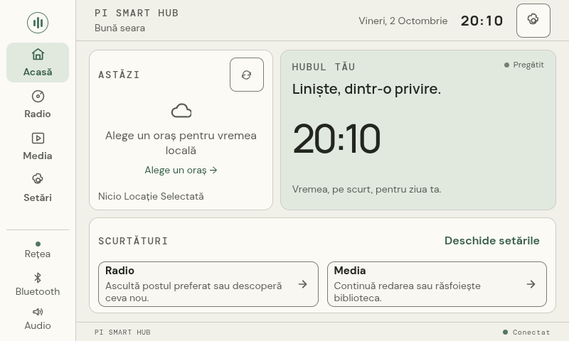

# Full UI browser audit — 2026-10-02

Scope: 800×480 CSS pixels, touch-capable Chromium, English/Romanian and E-Ink/night. Strict test-only API fixtures; no production device adapter returns fixture data.

`tests/e2e/product.spec.ts` captures first-run steps, physical-device-independent Home/weather UI, populated/empty/error Radio and Media, all seven settings tabs, quick/network/Bluetooth/audio/exit dialogs, Romanian keyboard characters, pairing confirmation rejection and backend disconnect/recovery. Layout checks inspect visible interactive target dimensions (minimum 48×48), viewport clipping outside intentionally scrollable panels, nested buttons and missing button names. They do not establish full contrast, physical touch, playback or OS acceptance.

The first run found undersized brand navigation, error retry, network scan and first-run actions, plus clipped service controls while playback and an error strip were visible. These were corrected; service and settings panels explicitly scroll when content exceeds their available area. Radio player controls now remain in the viewport. Rail status uses stable integration names and full accessible state labels.

Behavior regressions additionally verify catalog loading on Radio entry, sending the newly typed country filter, favorite identity/state, cancelling a settings keyboard without a preference write, and configured shortcut visibility after reloading. Fixtures use the real backend convention for radio catalog errors: HTTP 200 with an error field, not only HTTP failures.

Changes also translate Home/Radio headings and idle/end/error states, remove unsupported flag glyphs, name icon controls and sliders, format weather timestamps and greetings using the selected locale/timezone, reserve space for the playback bar, and present human-readable audio sink descriptions.

Results: 20 browser tests passed (zero skipped/flaky), TypeScript check and production Vite build passed; 39 backend tests passed. Browser captures are generated under ignored `test-results/`; raw test traces are not committed. Physical checks must be repeated on the next runtime candidate. All complete product criteria remain unaccepted.

## Real Raspberry preview

Source bd3b50d8a2b03344c886ff45693e3509aa2bdd90, runtime 1cc15fa4e625. Archive SHA-256 99094dc144433c49b38747c3ac801edca7e39cb7ab32263793e03083212e502e and all 33 file hashes verified on Pi. Previous preview stopped; new transient service uses the same isolated preferences/browser data. Language ro, theme ink, setupComplete true and preferred volume 25 persisted. No OS, boot or active networking changes.

Real BlueZ disconnect succeeded. After four seconds audio.ready was false; attempting local playback returned HTTP 409/no_audio_output. Explicit reconnect succeeded; after four seconds the known speaker was connected and audio.ready true. Sink gain reported 23% following reconnect, with saved preference 25%; these are reported values, not an assertion about absolute loudness.

Real catalog search for Romania returned 40 stations without stale/error. Radio Romania Actualități reached mpv state playing, position 9.69 seconds and live station metadata with error null; Bluetooth sink ready, gain 25%. Test stopped the stream after ten seconds. This is observed stream/route integration, not a new audible confirmation or complete Radio/Bluetooth acceptance. The earlier user-confirmed tone applies to the preceding candidate.

All 30 full product criteria remain OPEN. Pairing/forget/error flows, physical full UI matrix, mute, install/rollback, performance, cold boots and long-session stability still require evidence on a release candidate.
